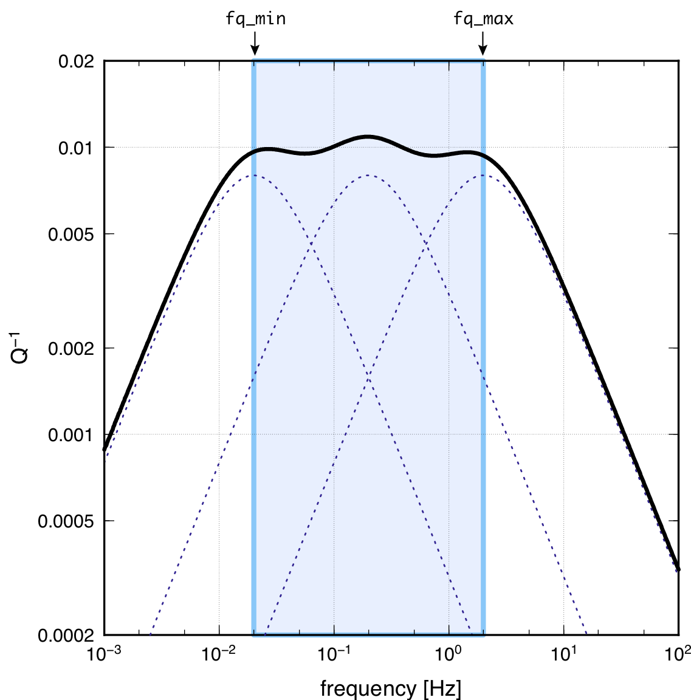

# 内部減衰と粘弾性体

`OpenSWPC`では粘弾性体モデルとしてGeneralized Zener Body (GZB)を採用し，複数の異なる緩和時間をもつ粘弾性体要素を並列に繋ぐことで，広い周波数帯域において一定の$Q$値を持つモデルを実現している．粘弾性モデルの採用により，実体波速度は物理分散性を持つことになる（e.g., Aki and Richards, 2002[^Aki2002]）．そのため，構造モデルで与えられたパラメタがどの周波数における値なのかを指定するための**基準周波数**をパラメタとして与える必要がある．

/// caption
GZBの構造模式図．互いにパラメタの異なるZener Body（矩形内）が複数並列で結合している．
///

[^Aki2002]: Aki, K., & Richards, P. G. (2002), Quantitative Seismology, 2nd Edition, University Science Books. 

/// caption
Q${}^{-1}$の周波数依存性の例．`nm=3`の場合の各粘弾性体構成要素の周波数依存性（破線）と合計された全体のQ${}^{-1}$モデル（実線）の周波数特性を示す．青色の領域が`fq_min`（左青線）と`fq_max`（右青線）で指定されたQ値一定の周波数範囲．
///

GZBはZener粘弾性体を$N_M$個並列に接続したモデルであり，弾性係数$\pi \equiv \lambda + \mu$と$\mu$それぞれに対応する緩和関数

\begin{align}
\begin{split}
    \psi_\pi \left( t \right) 
    &= 
    \pi_R 
    \left( 
      1 - 
      \frac{1}{N_M} 
      \sum_{m=1}^{N_M}
      \left( 1 -\frac{ \tau_m^{\epsilon P}}{\tau_{m}^\sigma} \right)
      e^{-t/\tau^\sigma_m}
    \right)
    H(t)
    \\
    \psi_\mu \left( t \right) 
    &= 
    \mu_R 
    \left( 
      1 - 
      \frac{1}{N_M} 
      \sum_{m=1}^{N_M}
      \left( 1 -\frac{ \tau_m^{\epsilon S}}{\tau^\sigma_m} \right)
      e^{-t/\tau^\sigma_m}
    \right)
    H(t)
\end{split}
\end{align}

を持つ．ただしここで，$\pi_R\equiv \lambda_R + 2 \mu_R$はP波のrelaxed
modulus, $\mu_R$はS波のrelaxed modulusである．また，$\tau_m^{\epsilon P}$と$\tau_m^{\epsilon S}$はそれぞれP波とS波のクリープ時間，$\tau_m^\sigma$は緩和時間と呼ばれる．異なる緩和時間をもつ粘弾性体モデルを多数並列させることにより，広い周波数帯で現実的な減衰をもつ媒質を表現している．
また，クリープ時間をP波とS波で独立に選ぶことにより，独立な内部減衰$Q_P$, $Q_S$を指定することができる．このモデルの構成方程式は，

\begin{align}
\begin{split}
    &\dot \sigma_{ii} (t) 
    = 
    \left( \dot \psi_\pi (t)  - 2 \dot \psi_\mu (t)  \right)
    \ast
    \partial_k v_k(t) 
    + 2 \dot \psi_\mu(t)  \ast \partial_i v_i(t) 
  \\
    &\dot\sigma_{ij} (t)
    = 
    \dot \psi_\mu(t) 
    \ast 
    \left( \partial_i v_j(t)  + \partial_j v_i(t)  \right)
\end{split}
\end{align}

となる．構成方程式に畳み込みが現れるが，メモリ変数法(Robertsson, 1994[^Robertsson1994])を用いることでこれを複数の1階の微分方程式の組に帰着させて数値計算を行う．また，(Blanch, 1994[^Blanch1994])の$\tau$-methodにより，以下に述べる最小限のパラメタから，指定周波数範囲で$Q$値がもっとも平坦になるようなモデルを自動的に選択する．

[^Robertsson1994]: 
Robertsson, J. O., J. O. Blanch, and W. W. Symes (1994), Viscoelastic finite-difference modeling, Geophysics, 59(9), 1444–1456, doi:10.1190/1.1443701.

[^Blanch1994]: Blanch, J. O., J. O. Robertsson, and W. W. Symes (1994), Modeling of a constant Q: methodology and algorithm for an efficient and optimally inexpensive viscoelastic technique, Geophysics, 60, 176–184, doi:10.1111/j.1365-246X.2004.02300.x.

!!! Info "Parameters"    
    **`fq_min`**
    : 粘弾性体$Q$一定値モデルの最小周波数 

    **`fq_max`**
    : 粘弾性体$Q$一定値モデルの最大周波数   
    
    **`fq_ref`**
    : 粘弾性体$Q$一定値モデルにおいて速度値が定義される基準周波数 

図に示すように，パラメタ`fq_min`と`fq_max`の間の周波数帯で，Q値がほぼ一定の値をとる．その外側では，周波数の2次で減衰が小さくなる．このQモデルは複数の粘弾性体（図中点線）の重ね合わせで実現される．そのため，より広帯域でQを維持するためには，メモリ変数の数（埋め込みパラメタ`NM`）を増やす必要がある．しかし，これは計算量とメモリ使用量の大幅な増大を招く．設定したパラメタ下でのQ値の周波数依存性は，プログラム`qmodel_tau.x`で調べることができる．

広帯域で平坦な減衰モデルを採用すると，物理分散性により実体波の速度が周波数に依存するようになる．そこで基準周波数`fq_ref`
を定義し，構造モデルで入力された速度は周波数`fq_ref`での速度であることが仮定される．
