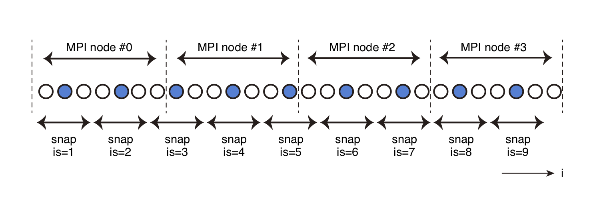

# 出力ファイルの設定

## 出力ファイル形式

`OpenSWPC` は，2次元断面における地震波の時空間発展のスナップショットと，観測点における時系列波形の2種類のデータを出力できる．

スナップショットのファイル出力には，`NetCDF`形式のデータ（推奨）もしくはFortranのStream I/O機能を用いた独自形式（以下native形式；旧形式のため非推奨）のバイナリデータを選択できる．波形出力は`SAC`形式もしくはそれを結合した独自形式（`CSF`）および`tar`アーカイブで行われる．

どちらの出力に対しても明示的なエンディアン変換は行わないため，生成されるファイルは実行環境のエンディアンに依存する．ただし，SACおよびNetCDFのライブラリはエンディアンに依存せずファイルを読むことができるため，これらのフォーマットを使っている限り，エンディアンについて意識する必要はほとんど無い．

なお，波形・スナップショットとも水平成分の方向は計算座標系の$x$, $y$, $z$に準ずる．`phi=0`であれば$x$, $y$はそれぞれ北・東であるが，計算座標系を回転している（`phi`がゼロでない）場合には注意が必要である．この座標系の回転角は波形出力の`SAC`ファイルヘッダのcmpazに格納されているため，後処理で容易に北・東を正にする方向に変換することができる．また，鉛直方向の座標は下が正であるが，波形出力においては観測地震学の慣例に従い上が正になるように反転されている．一方，スナップショットの速度出力の$z$成分は計算座標系（鉛直下方が正）のままである．

### 波形ファイルのヘッダ

波形出力のSACファイルには，SACで必須とされる標準的なヘッダの他，以下の表のヘッダが付加される．
波形記録の単位は，`SAC`フォーマットの標準に従い，速度はnm/s, 変位はnm が採用されている．

| header name               | description                                                                                                               |
| ------------------------- | ------------------------------------------------------------------------------------------------------------------------- |
| `kevnm`                   | `title`                                                                                                                   |
| `evlo`, `evla`, `evdp`    | 震源リストの1行目の震源位置．震源位置がデカルト座標系で与えられた場合にはパラメタ`clon`と`clat`をもとに緯度経度変換する． |
| `o`                       | 震源リスト1行目の震源破壊開始時間．                                                                                       |
| `kzdate`, `kztime`        | プログラム実行開始日時                                                                                                    |
| `b`                       | `tbeg`                                                                                                                    |
| `delta`                   | `ntdec_w * dt`                                                                                                            |
| `mag`                     | 震源モーメントから換算される$M_W$                                                                                         |
| `user0`, .., `user5`      | 震源リスト1行目の $m_{xx}, m_{yy}, m_{zz}, m_{yz}, m_{xz}, m_{xy}$                                                        |
| `user6`, `user7`, `user8` | `clon`, `clat`, `phi`                                                                                                     |
| `kstnm`                   | `stnm`                                                                                                                    |
| `stlo`, `stla`, `stdp`    | 観測点位置．観測点が`xy`で与えられた場合には緯度経度に変換の上出力される．                                                |
| `kcmpnm`                  | 速度の場合`Vx, Vy, Vz`, 変位の場合`Ux, Uy, Uz`                                                                            |
| `cmpinc`,`cmpaz`          | `x, y`の方向に応じた観測点極性方向                                                                                        |
| `idep`                    | SACフォーマットに従い，速度波形では7, 変位では6が格納される                                                               |

Native形式のスナップショットファイルには，ヘッダ情報，構造（地表であれば地形，断面であれば速度構造），空間スナップショットの順にデータが格納される．

### スナップショットのヘッダ

以下のヘッダ項目は NetCDF ファイルであればファイルのattributeに指定されている．Native形式においてはファイル先頭にこれらの情報が埋め込まれている．どちらのファイル形式についても，ユーティリティプログラム `read_snp.x` で読み出すことができる．

| var name     | type          | description                                                      |
| ------------ | ------------- | ---------------------------------------------------------------- |
| `bintype`    | character(8)  | `"STREAMIO"`に固定                                               |
| `codetype`   | character(8)  | コード種別により`"SWPC_3D"` or `"SWPC_PV"` or `"SWPC_SH"`        |
| `hdrver`     | integer       | ヘッダバージョン．バージョンによりヘッダ内容が異なる可能性あり． |
| `title`      | character(80) | 実行名．                                                         |
| `exedate`    | integer       | 実行日時．POSIX TIMEで与える．                                   |
| `coordinate` | character(2)  | 断面成分．`'xy'`, `'xz'`, `'fs'`, `'ob'`など．                   |
| `datatype`   | character(2)  | データ種別．`'ps'` or `'v2'` or `'v3'`                           |
| `ns1,ns2`    | integer       | スナップショット各辺のデータ数                                   |
| `beg1,beg2`  | real          | 各辺の始点座標値                                                 |
| `ds1,ds2`    | real          | グリッド間隔                                                     |
| `dt`         | real          | スナップショットの時間間隔                                       |
| `na1,na2`    | real          | 吸収境界領域のスナップショットグリッド数                         |
| `nmed`       | integer       | 媒質データの個数                                                 |
| `nsnp`       | integer       | 1時間ステップあたりのスナップショット枚数                        |
| `clon,clat`  | real          | 座標中心緯度経度                                                 |
| `v1,v2,v3`   | real          | 予備．本コードでは利用しない．                                   |

!!! Caution "SAC ヘッダの変更"
    SAC ヘッダのうち，`evdp` は従来は m 単位であったが，OpenSWPC Version 5.0 以降は km の単位を取るように変更された．

スナップショットとして`NetCDF`形式を用いた場合も，この表に相当する global attributes が設定される．そのほかは`NetCDF`の[COARDS規約](https://ferret.pmel.noaa.gov/Ferret/documentation/coards-netcdf-conventions)
および一部[CF拡張](http://cfconventions.org)に従う．この規約に従っていることにより，`OpenSWPC`により出力された`NetCDF`ファイルは，同形式を読み込める多くの科学的可視化ツール（たとえばParaView，PanoplyやGMTなど）でそのまま読み取ることができる．

## スナップショット出力

3次元空間のうち，`xy`, `yz`, `xz`それぞれの方向の水平断面と地表面（`fs`）・海底面（`ob`）に沿った面の波動場スナップショットを出力することができる．
出力可能なのは速度振幅（`v`）, 変位振幅（`u`）および速度振幅の発散と回転（`ps`）の3種類である．

すべての時間ステップにすべてのデータを出力するのはデータ容量と入出力時間から現実的ではないため，時間と空間の両方に間引き要素を導入している．
時間については積分開始時間を始点として，`ntdec_s`ステップ毎に出力を行う．空間については，指定された$x$, $y$, $z$方向の間引き間隔`idec`, `jdec`, `kdec`により間引きが行われる（下図）

/// caption
スナップショット間引きの模式図．丸印が$i$方向の座標グリッドで，点線がMPIのドメイン境界を示す．間引き要素はidec=3の場合を示している．青色に塗りつぶされたグリッドからのデータがスナップショットとして出力される．
///

このとき，各MPIノード内で出力されるグリッド点数は一定とは限らない（一定となるように出力間隔やグリッドサイズを調整する必要は無い）．
データはすべて特定のノードに集約されて，`snp_format`パラメタの値により，独自形式（`native`）もしくは`NetCDF`形式のバイナリファイルとして出力される．

入力パラメータでは各スナップショット断面の出力の有無や間引き要素を制御する．なお，2次元SH計算では1成分しかないためP波S波出力は生成されない．

!!! Info "Parameters"

    **`snp_format`**
    : スナップショットファイルの出力フォーマット．`"native"`（Fortran独自フォーマット，非推奨）もしくは `"netcdf"`（`NetCDF`形式．推奨）のいずれかを指定する． 
     
    **`xy_ps%sw`, `xz_ps%sw`, `yz_ps%sw`, `fs_ps%sw`, `ob_ps%sw`**
    : 各断面でのPS振幅（$\text{div}(\mathbf{v})$, $\text{rot}(\mathbf{v})$）の出力スイッチ．                                                        
    
    **`xy_v3%sw`, `xz_v3%sw`, `yz_v3%sw`, `fs_v3%sw`, `ob_v3%sw`**
    : 各断面での3成分速度スナップショットの出力スイッチ．
    
    **`xy_u3%sw`, `xz_u3%sw`, `yz_u3%sw`, `fs_u3%sw`, `ob_u3%sw`**
    : 各断面での3成分変位スナップショットの出力スイッチ．
    
    **`z0_xy`**
    : xy断面を出力する深さ (km)
    
    **`x0_yz`**
    : yz断面を出力するx座標位置 (km)
    
    **`y0_xz`**
    : xz断面を出力するy座標位置 (km)
    
    **`ntdec_s`**
    : スナップショット出力の時間間引き要素．計算時間ステップ`ntdec_s`回に1度出力される．

    **`idec`, `jdec`, `kdec`**
    : スナップショット出力の$x$, $y$, $z$方向の空間間引き要素．
    

## 地震波形出力

波形出力オプションが`sw_wav_v=.true.`もしくは`sw_wav_u=.true.`の場合，観測点における速度や変位の時系列を，原則としてSACフォーマットの波形あるいはその派生物として出力する．
変位計算のための時間積分は出力時の時間間引きを行う前に実行されるため，時間間引き後の速度波形を積分するよりも高精度である．計算中は地震波形はメモリ上に保持され，計算終了時にまとめて出力される．

### 観測点位置の指定

観測点位置は計算座標系(`xy`)か地理座標系(`ll`)かいずれかのフォーマット（下表）で与える．

| Type   | Format                        |
| ------ | ----------------------------- |
| `'xy'` | `x      y     z   name   zsw` |
| `'ll'` | `lon    lat   z   name   zsw` |

複数の観測点における出力が必要な場合は，観測点位置ファイルに改行区切り観測点を加えていけばよい．ただし，`’xy’`と`’ll’`のフォーマットを混ぜることはできない．観測点数は自動的にカウントされ，そのうち計算モデル内にある観測点のみが出力される．`

観測点の深さは，入力`zsw`によって次の表のように変化させることができる．
地表や海底の形状はグリッドに沿った階段状に離散化されるため，観測点の深さから直接変換する（`zsw=’dep’`）と，観測点が意図せずに空中に飛び出し，意図した結果が得られない場合がある．
海底の観測点の場合には，波形出力の位置が海底の固体側にあるか海中側にあるかによって，その水平動振幅が大きく異なる．

そこで，`zsw`の値の指定により，海面上の観測点や海底，ならびに海底の底の観測点をそれぞれ模擬することができる．
特段の事情が無い限り，`zsw = ’obb’`としておくのが良い．

| `zsw`                    | 観測点深さ                                  |
| ------------------------ | ------------------------------------------- |
| `’dep’`                  | 与えられたzstから計算                       |
| `’fsb’`                  | 地表・海面グリッドの一つ下                  |
| `’obb’`                  | 地表・海底グリッドの一つ下                  |
| `’oba’`                  | 地表・海面グリッドの一つ上                  |
| `’bdi’ (i=0, \cdots, 9)` | 速度構造モデルで定義される`i`番目の内部境界 |

### 出力フォーマット

データフォーマットはSAC形式が基本である．ただし，SACファイルは1観測点1成分で一つのファイルのため，多数の観測点の多項目波形を出力するとファイル数が膨大になり，取り回しが悪い．そこで，観測点ごとや，計算ノード単位で波形を `tar` アーカイブとしてひとつにまとめたファイルを出力することもできる (**New in Version 25.01**)．

Version 3.0以降ではパラメタ`wav_format = ’csf’`が指定されると，`SAC`ファイルを複数観測点・成分について単一ファイルに結合したcsfファイル（独自形式）の出力を選択することもできる．csfフォーマットは，SAC形式のバイナリファイルを単純結合したものの先頭に3つの4バイト実数をヘッダとして付加しただけの単純なフォーマットである．ヘッダは以下の構成要素からなる．

!!! Info "CSF header format"
    **`identifier`**
    : 4文字 'CSFD'

    **`ntrace`**
    : ファイル内に格納されている波形の数
    
    **`npts`**
    : 一つ一つの波形の時間サンプル数

ファイルに含まれる波形のサンプル数はすべて等しいことが仮定されている．csf出力が選択された場合，並列計算のノード毎に，そのノードに含まれる観測点の同じ成分の波形が一つのファイルにまとめられて出力される．

!!! Caution "大量の波形出力"
    大規模スーパーコンピュータシステムにおいては，並列ファイルシステムlustreが採用されていることがある（たとえば東京大学Oakforestなど）．Lustreは小さなファイルを多数扱うことをやや苦手にしており，SAC形式で大量の波形を出力すると，パフォーマンスが落ちることがある．そのような場合には，tarやcsfフォーマットのような結合フォーマットが便利である．

!!! Note
    `csf`よりも`tar` アーカイブのほうが汎用性に優れているため，`csf`形式の出力は非推奨となり，今後のバージョンで削除される予定である．

!!! Important "`wav_calc_dist` と `lcalda` ヘッダ"
    Version 24.09 までは `wav_calc_dist` オプションが `.true.` のとき，計算座標系における水平距離を震央距離としてSACヘッダに格納していた．Version 25.01 以降は常に震央距離を格納し，SACが距離を上書きしないよう `lcalda` ヘッダを`.false.` に設定するようになった．それにともない，パラメタ `wav_calc_dist` は廃止された．

### ひずみ・応力波形出力

速度や変位波形と同様に，`sw_wav_strain = .true.` とすることでひずみ波形を，`sw_wav_stress = .true.`とすることで応力波形を，それぞれSAC形式の時系列データとして出力することができる（new in version 5.0)．観測点位置の指定は速度・変位と同じである．出力単位は歪は無次元，応力は\[Pa\]である．

### 波形出力のタイミング

観測点における地震波形は計算中にはメモリ内に蓄積され，計算終了時にまとめてファイルに出力される．ただし，パラメタ `ntdec_w_prg` を `1` 以上の整数に設定すると，その数値の時間ステップ毎に波形を出力することができる．その際，波形の長さは常に `nt` で決まる時間長のままで，計算が完了していない部分はゼロ埋めされる．この機能は計算途中に計算の正常性をモニターするためであるが，あまり `ntdec_w_prg` を小さくすると，出力の負荷によって計算時間が増加する場合があることに注意が必要である．

!!! Info "Parameters"

    **`sw_wav_v`**, **`sw_wav_u`**, **`sw_wav_strain`** **`sw_wav_stress`**
    : 速度(v)・変位(u), ひずみ(strain)，応力 (stress) 波形の出力スイッチ．
    
    **`ntdec_w`**
    : 波形出力の時間間引き間隔．1で全時間ステップの記録を出力する．
    
    **`st_format`**
    : 観測点位置ファイルのフォーマット．'xy'なら計算座標，'ll'なら地理座標モード．
    
    **`fn_stloc`**
    : 観測点ファイル名．
    
    **`wav_format`**
    : 波形ファイルフォーマット．`’sac’` ,  `'tar_st'`, '`tar_node'`, `'csf'` のいずれかを指定．`tar_st` は観測点ごとに，`tar_node` は計算ノードごとに波形をまとめた`tar`アーカイブファイルを出力する．

    **`ntdec_w_prg`** (New in Version 24.09)
    : 計算途中の波形出力タイミング．このパラメタに指定された時間ステップ毎に波形を出力する．0以下の場合は計算終了時まで波形を出力しない．

## 計算時間出力

To analyze the performance of the code, the computation time of each block can be measured. This file can be visualized by using the `tools/timvis.gmt` script.

!!! Info "Parameters"

    **`stopwatch_mode`**
    : 計算時間の出力スイッチ．`.true.` で各サブルーチンごとの計算時間を出力する．

## 出力ファイル名

計算結果は以下のようなファイル名で出力される（Version 25.01 で変更）．

-   スナップショット     `(odir)/(title).(code).(section).(type).(ext)`
-   波形(SAC)    `(odir)/wav/(title).(code).(stnm).(component).sac`
-   波形(CSF)   `(odir)/wav/(title).(code).(node-ID).(component).csf`
-   波形(TAR-ST)     `(odir)/wav/(title).(code).(stnm).tar`
-   波形(TAR-NODE)   `(odir)/wav/(title).(code).(node-ID).tar`
-   計算時間   `(odir)/wav/(title).tim`

ここで，`(section)`は出力断面を表す2文字で，特定位置の断面であれば`xy`,`yz`などと表す．地表面と海底はそれぞれ`fs`（Free
Surface）ならびに`ob`（Ocean Bottom）で表される．
`(type)`は速度振幅かP波・S波（div,
rot）かによって`v`もしくは`ps`を取る． `(code)`は計算に用いたコードの種別で，`3d`, `psv`, `sh` のいずれかを取る．
`(component)`は速度か変位かに応じて`Vx`, `Vy`, `Vz`あるいは`Ux`, `Uy`, `Uz`を取る．
スナップショットの拡張子`(ext)`はNetCDF形式で`nc`，native形式で`snp`である．

