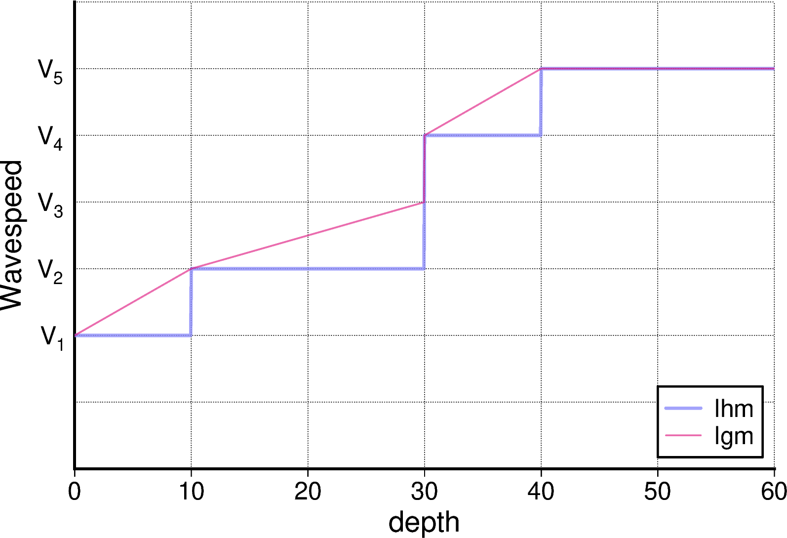

# 速度構造の指定 

## 構造モデルの選択

`OpenSWPC`の入力速度構造は層構造モデルを基本としている．一つ一つの層は，深さ（もしくは高さ）の変化を持つ$x$--$y$（もしくは緯度経度）の面であり，これを地震波速度・密度ならびに内部減衰の等値面として取り扱う．
変数`vmodel_type`の設定によって一様構造，成層構造，あるいは`NetCDF`バイナリ入力種別を選択できる．

!!! Info "Parameters"

    **`vmodel_type`**
    : 速度構造モデルタイプの指定．

        **`’uni’`**
        :  一様均質構造．

        **`’lhm’`**
        :  Layered Homogeneous Medium．深さ範囲（層）ごとに一定の物性値を持つモデル．

        **`'lgm'`** (New in Version 25.01)
        : Linear Gradient Model. 地震波速度が層内で線形に変化するモデル．


        **`’grd’`**
        :   `NetCDF` ファイル群による構造入力．

        **`’user’`**
        :   ユーザーのコーディングによる速度構造指定．


構造モデルの選択により，必要となる追加パラメタが各々異なる．

### `vmodel='uni'`

以下の追加パラメタを必要とする．

!!! Info "Parameters"

    **`vp0`** 
    : 一様構造のP波速度

    **`vs0`** 
    : 一様構造のS波速度
    
    **`rho0`** 
    : 一様構造の質量密度
    
    **`qp0`**  
    :  一様構造の $Q_P$
    
    **`qs0`**  
    :  一様構造の $Q_S$
    
    **`topo0`** 
    : 一様構造の地表面深さ．`0`以上の場合には$z=0$から`topo0`まで海水で満たされる．


### `vmodel='lhm' & 'lgm'` 

`lhm` (Layered Homogeneous Medium)および`lgm`では，各層の境界面深さと物性値をテーブルで指定する．

!!! Info "Parameters"

    **`fn_lhm`**
    : 成層構造指定ファイル．1行に層の深さ・密度・P波速度・S波速度・QP・QSを空白区切りで記入する．`#`はコメント行として扱われる．指定された深さ以深の構造がその行の物性値で満たされる．以下の例を参考のこと．    
    ```C
    # depth  rho(g/cm^3)  vp(km/s)   vs(km/s)     Qp      Qs
    # -------------------------------------------------------
          0        2.300      5.50      3.14     600     300
          3        2.400      6.00      3.55     600     300
         18        2.800      6.70      3.83     600     300
         33        3.200      7.80      4.46     600     300
        100        3.300      8.00      4.57     600     300
        225        3.400      8.40      4.80     600     300
        325        3.500      8.60      4.91     600     300
        425        3.700      9.30      5.31     600     300
    
    ```

`lhm`も`lgm`も同じファイル（どちらの場合もパラメタ名は `fn_lhm`）だが，同じファイルから作られる物性値は互いに異なる．`lhm` の場合には第1列の深さより下の層が，第2列〜第6列で指定された一様な物性値で満たされる．対して `lgm` の場合は，1行下の層まで，物性値が線形に変化する．ただし，最下層（最終行）は `lhm` と同じ挙動を示す．

これらの挙動を理解するため，以下のような単純化したモデルを考える．本来は密度，Vp, Vsなど複数の値があるが，単一の速度値で説明する．

```c
# depth  velocity
# ----------------
      0        V1
     10        V2
     30        V3
     30        V4
     40        V5
```

この構造モデルファイルにより作られる深さ依存速度構造は，下図のようになる．


/// caption
同じ構造指定ファイルから作成される `lhm` と `lgm` の深さ依存速度構造の違いの例．`lhm` は層内で物性値が一様であるのに対し，`lgm` は層内で物性値が線形に変化する．
///

`lhm` の場合には各層の深さより下の層がその行の物性値で満たされている．上記の例では深さ30 kmの層が2つあり，物性値に `V3` と `V4` がそれぞれ指定されているが，`lhm` の場合には `V3` の層は厚さ0のため無視される．

一方で `lgm` の場合には，各層の物性値が次の層の値まで深さとともに線形に変化する．この場合，2つある深さ 30 km の層の物性値が異なることで，不連続面も表現できる．もちろん，たとえば

```c
 0 V1
10 V1
```

のように2行にわたって同じ値が指定されている場合には， `lhm` と同じように一定範囲（この場合は 10-20 km）にわたって同じ物性値（`V1`）が適用される．すなわち，`lgm` は `lhm` で表現可能な構造をすべて表現できるが，`lhm` と `lgm` で同じ構造となるようは構造指定ファイルは互いに異なっている．


### `vmodel='grd'` 

`NetCDF` ファイル群による構造入力には，以下の追加パラメタが必要である．

!!! Info "Parameters"

    **`dir_grd`**
    : grdファイル格納ディレクトリ．

    **`fn_grdslt`**
    : grdファイル名と物性値のリストファイル．以下の例を参照．一つ一つのgrdファイルは構造境界の上面の深さを指定する．深さの単位は "m" である．各層毎に，物性値（密度・地震波速度・Q値）を指定する．また，`sw`で特定の境界面のgrdファイルを指定することができる．この`sw`震源の深さをプレート境界に一致させる（オプション`sdep_fit`）際に用いられる．最上面は地表面として取り扱われる．それより上層については，$z\le 0$は海水層，それ以外は空気として扱われる．
    ```C
    # grd filename          rho    vp    vs    QP   QS  sw
    # -------------------------------------------------------
    'eJIVSM_01_TAB_.grd'   1.80  1.70  0.35   119    70  0 
    'eJIVSM_02_BSM_.grd'   1.95  1.80  0.50   170   100  0 
    'eJIVSM_03_BSM_.grd'   2.00  2.00  0.60   204   120  0 
    'eJIVSM_04_BSM_.grd'   2.05  2.10  0.70   238   140  0 
    'eJIVSM_05_BSM_.grd'   2.07  2.20  0.80   272   160  0 
    'eJIVSM_06_BSM_.grd'   2.10  2.30  0.90   306   180  0 
    'eJIVSM_07_BSM_.grd'   2.15  2.40  1.00   340   200  0 
    'eJIVSM_08_BSM_.grd'   2.20  2.70  1.30   442   260  0 
    'eJIVSM_09_BSM_.grd'   2.25  3.00  1.50   510   300  0 
    'eJIVSM_10_BSM_.grd'   2.30  3.20  1.70   578   340  0 
    'eJIVSM_11_BSM_.grd'   2.35  3.50  2.00   680   400  0 
    'eJIVSM_12_BSM_.grd'   2.45  4.20  2.40   680   400  0 
    'eJIVSM_13_BSM_.grd'   2.60  5.00  2.90   680   400  0 
    'eJIVSM_14_BSM_.grd'   2.65  5.50  3.20   680   400  0 
    'eJIVSM_15_UPC_.grd'   2.70  5.80  3.40   680   400  0 
    'eJIVSM_16_LWC_.grd'   2.80  6.40  3.80   680   400  0 
    'eJIVSM_17_CTM_.grd'   3.20  7.50  4.50   850   500  0 
    'eJIVSM_18_PH2_.grd'   2.40  5.00  2.90   340   200  1 
    'eJIVSM_19_PH3_.grd'   2.90  6.80  4.00   510   300  0 
    'eJIVSM_20_PHM_.grd'   3.20  8.00  4.70   850   500  0 
    'eJIVSM_21_PA2_.grd'   2.60  5.40  2.80   340   200  2 
    'eJIVSM_22_PA3_.grd'   2.80  6.50  3.50   510   300  0 
    'eJIVSM_23_PAM_.grd'   3.40  8.10  4.60   850   500  0 
    ```

    **`node_grd`**
    : データ読み込み担当ノード．すべての層構造ファイルはここで指定されたノードから読み込まれ，MPIによって全ノードにデータ転送される．

    **`topo_flatten`**
    : 地形変化を強制的に平坦にする．その分地下構造もオフセットされる．

    !!! Warning "`topo_flatten` 名称変更の注意"
        このオプションはVersion 5.1までは `is_flatten` であったが，Version 5.2で実装された `earth_flattening` オプションとの混同を避けるため名前が変更された．
        

### `vmodel='user'`

このモードでは，`src/swpc_*/m_vmodel_user.F90` 内のサブルーチンでユーザーが定義する速度構造が読み込まれる．このF90ファイルを変更した場合には**再コンパイルが必要**となる．パラメタファイルから任意のパラメタを読みこんだり，あるいはパラメタを追加することも容易にできる．その方法やサブルーチンの引数についてはファイル内コメントを参照のこと．


## 空気および海水層の取り扱い


`OpenSWPC` では，空気層は密度 $\rho=0.001$ \[g/cm${}^3$\]，地震波速度$V_P=V_S=0$
\[km/s\]，内部減衰$Q_P = Q_S = 10^{10}$をそれぞれ仮定している．
空気層は事実上真空として扱えるほどに小さな密度を持ち，かつ地震波速度が0であるため，空中音波は伝播しない．
従って，空気層中の$Q$値は結果に影響しない．
ただし，計算コード中に密度の逆数を求める演算があるため，**空気層の密度はゼロにしてはならない**．

いかなる構造モデルであれ，構造が与えられている最も浅い深さが$z>0$ である場合，そこから$z=0$ までは海水で満たされている，と仮定される．つまり，海水層を別に層として与える必要はない．
海水層ではデフォルトで$\rho=1.0$
\[g/cm${}^3$\], $V_S=0.0$ \[km/s\], $Q_P = Q_S = 10^6$を用いている．
海中音波の減衰は非常に小さいことが知られており，事実上無減衰になるようなQ値を導入している．
また，P波速度は$V_P=1.5$ \[km/s\] であるが，Version 5.2 以降では `munk_profile = .true.` にすることにより，以下の式で定まる Munk's profile を用いることもできる．

$$
\begin{align}
&V_P(z) = 1.5 \times \left[ 1.0 + 0.00737 \left( z_b - 1 + e^{-zb} \right) \right] \text{[m/s]}, \quad
&z_b = 2(z-1.3) /1.3
\end{align}
$$

ただし$z$の単位は km である．この構造は水深1,300 mにSOFARチャネルに該当する極小を持つ．このパラメタが`.false.`の場合には$V_P = 1.5$ km/s の一様な値が用いられる．

地表ならびに海底面では，差分式を2次精度変更する境界条件が適用される（e.g., Okamoto and Takenaka, 2005[^OT2005]; Maeda and Furumura, 2003[^MF2003]）．海底ならびに地表の境界は，$\mu$と$\lambda$が有限の値から0になる，という条件を用いて自動的に抽出される．


!!! Info "Parameters"

    **`is_ocean`** 
    : 海水モード．`.true.`（デフォルト）の場合$z=0$より地表面（最も浅い面）までは海水で満たされる．`.false.`の場合には海底面の上はすべて空気となり，海底が自由表面として取り扱われる．

    **`munk_profile`** &nbsp; **(new in version 5.2)**
    : `.true.` のとき，海水層中に極小値を持つMunk's profileが適用される．`.false.`であれば一定値が用いられる．


[^OT2005]: Okamoto, T., and H. Takenaka (2005). Fluid-solid boundary implementation in the velocity-stress finite- difference method, _Zisin 2_, _57_, 355–364, doi:10.4294/zisin1948.57.3_355. (in Japanese with English Abstract) [(article link)](https://doi.org/10.4294/zisin1948.57.3_355)

[^MF2003]: Maeda, T., and T. Furumura (2013), FDM simulation of seismic waves, ocean acoustic waves, and tsunamis based on tsunami-coupled equations of motion, _Pure Appl. Geophys._, _170_(1-2), 109–127, doi:10.1007/s00024-011-0430-z. [(article link)](https://doi.org/10.1007/s00024-011-0430-z)


## ランダム媒質の重畳


速度構造それぞれに対して，平均速度を成層構造であたえ，それに別途生成したランダムな短波長速度ゆらぎを重畳させることができる．ランダムな速度ゆらぎ$\xi$を事前に生成しておき，別途定義される平均的速度構造$V_{P0}$,
$V_{S0}$, $\rho_0$に対して， 

$$
\begin{align}
  V_P = V_{P0} \left( 1 + \xi \right) , \, V_S = V_{S0} \left( 1 + \xi \right) , \,
  \rho = \rho_0 \left( 1 + \nu \xi \right)
\end{align}
$$

のようにゆらぎを与える．ただし，ここでは$\nu=0.8$とするBirch則を採用している（Sato et al., 2012[^SFM2012]）.

[^SFM2012]: Sato, H., M. C. Fehler, and T. Maeda (2012), _Seismic Wave Propagation and Scattering in the Heterogeneous Earth: Second Edition_, Springer Berlin Heidelberg, Berlin, Heidelberg, doi:10.1007/978-3-642-23029-5.

ランダム媒質の生成のためには，[別ツール](../3._Tools/0304_rmedia.ja.md) が提供される．
ランダム媒質は3次元もしくは2次元の`NetCDF`ファイルとして与えられ，グリッド毎の速度ゆらぎ率$\xi(I,J,K)$が定義されている．並列計算のためにファイルを分割する必要は無く，計算の各ノードが，自ノードの計算担当領域の`(i,j,k)`範囲に相当するデータを自動的に抽出する．計算サイズ`Nx,Ny,Nz`がランダム媒質ファイルの次元長よりも大きい場合には，周期的境界条件によって同じランダム媒質を繰り返してモデル領域全体を埋める．実行プログラムは，ランダム媒質の空間グリッドサイズとシミュレーションのグリッドサイズが一致しているかどうか確認しない．計算の空間格子サイズを変更した場合，ランダム媒質も作成し直す必要がある．

!!! Info "Parameters"

    **`vmodel_type`**
    : 速度構造モデルタイプの指定．

        **`’uni_rmed’`**
        :  一様均質構造 ＋ ランダム媒質

        **`’lhm_rmed’`**
        :  Layered Homogeneous Medium ＋ ランダム媒質

        **`'lgm_rmed'`**
        : Linear Gradient Model ＋ ランダム媒質

        **`’grd_rmed’`**
        :   `NetCDF` ファイル群による構造入力 ＋ ランダム媒質

    **`dir_rmed`**
    : ランダム媒質データ格納ディレクトリ


### `vmodel='uni_rmed'`

`vmodel=’uni’`のパラメタに加えて，以下が必要となる．

!!! Info "Parameters"
    **`fn_rmed0`**
    : ランダム媒質ファイル名

このモデルでは，平均速度に`fn_rmed0`で与えられたゆらぎを重畳させる．ファイルが存在しない場合にはゆらぎが0であると見なす．


### `vmodel='lhm_rmed' & 'lgm_rmed'`

`vmodel=lhm_rmed`では，`vmodel=’lhm’`の成層構造の各層にランダム媒質を重畳させる．その際，各層に異なるランダム媒質を重畳させることも可能である．このモデルでは，`fn_lhm`のかわりに以下のパラメタを用いる：

!!! Info "Parameters"

    **`fn_lhm_rmed`**
    : 構造リスト
    構造リストは`fn_lhm`に準じたフォーマットを取るが，その最右欄に，以下の例のように各層のランダム媒質ファイル名を記載する．
    ``` c
    # depth  rho(g/cm^3)  vp(km/s)   vs(km/s)     Qp      Qs     fn_rmed
    # ----------------------------------------------------------------------
          0        2.300      5.50      3.14     600     300     rmedia1.nc
          3        2.400      6.00      3.55     600     300     rmedia1.nc
         18        2.800      6.70      3.83     600     300     rmedia2.nc
         33        3.200      7.80      4.46     600     300     rmedia2.nc
        100        3.300      8.00      4.57     600     300     -
        225        3.400      8.40      4.80     600     300     -
        325        3.500      8.60      4.91     600     300     -
        425        3.700      9.30      5.31     600     300     -
    ```
    この例では，0 kmと3 kmの層に`rmedia1.nc`, 18 kmと33 kmの層に`rmedia2.nc`を配置する．それより深い部分についてはダミー文字`"-"`が書かれている．該当する名前のファイルが存在しなければ，これらの領域には速度ゆらぎは重畳されない．


ランダム媒質ファイルは`dir_rmed`から探される．
パラメタ`dir_rmed`を用いずに`fn_lhm`の欄に直接ディレクトリ名を書いてもかまわないが，その場合はかならずファイル名全体をクォーテーションで括ること．
ゆらぎ与えない場合にも，ランダム媒質ファイルの欄には何らかの文字が書かれていなければならない．ファイル名の欄が空白だとエラーになる．

### `vmodel='grd_rmed'`

このモードでは，`vmodel=’grd’`の成層構造の各層にランダム媒質を重畳させる．各層に異なるランダム媒質を重畳させることも可能であり，かつランダム媒質の$k$（鉛直）方向の基準位置を任意の層境界に設定することが可能である．
このモデルでは，`fn_grd`のかわりに以下のパラメタを用いる．

!!! Info "Parameters"
    **`fn_grdlst_rmed`**
    : 構造リスト
    構造リストは`fn_grdlst`に準じたフォーマットを取るが，以下の例のように，右欄にランダム媒質ファイル名と基準層の番号を記述する．
    ```C
    # grd filename          rho    vp    vs   QP   QS  sw  fn_rmed      ref
    # -----------------------------------------------------------------------
    'eJIVSM_01_TAB_.grd'   1.80  1.70  0.35   119    70  0 'rmed3d_1.nc' 0
    'eJIVSM_02_BSM_.grd'   1.95  1.80  0.50   170   100  0 'rmed3d_1.nc' 0
    'eJIVSM_03_BSM_.grd'   2.00  2.00  0.60   204   120  0 'rmed3d_1.nc' 0
    'eJIVSM_04_BSM_.grd'   2.05  2.10  0.70   238   140  0 'rmed3d_1.nc' 0
    'eJIVSM_05_BSM_.grd'   2.07  2.20  0.80   272   160  0 'rmed3d_1.nc' 0
    'eJIVSM_06_BSM_.grd'   2.10  2.30  0.90   306   180  0 'rmed3d_1.nc' 0
    'eJIVSM_07_BSM_.grd'   2.15  2.40  1.00   340   200  0 'rmed3d_1.nc' 0
    'eJIVSM_08_BSM_.grd'   2.20  2.70  1.30   442   260  0 'rmed3d_1.nc' 0
    'eJIVSM_09_BSM_.grd'   2.25  3.00  1.50   510   300  0 'rmed3d_1.nc' 0
    'eJIVSM_10_BSM_.grd'   2.30  3.20  1.70   578   340  0 'rmed3d_1.nc' 0
    'eJIVSM_11_BSM_.grd'   2.35  3.50  2.00   680   400  0 'rmed3d_1.nc' 0
    'eJIVSM_12_BSM_.grd'   2.45  4.20  2.40   680   400  0 'rmed3d_1.nc' 0
    'eJIVSM_13_BSM_.grd'   2.60  5.00  2.90   680   400  0 'rmed3d_1.nc' 0
    'eJIVSM_14_BSM_.grd'   2.65  5.50  3.20   680   400  0 'rmed3d_1.nc' 0
    'eJIVSM_15_UPC_.grd'   2.70  5.80  3.40   680   400  0 'rmed3d_1.nc' 0
    'eJIVSM_16_LWC_.grd'   2.80  6.40  3.80   680   400  0 'rmed3d_3.nc' 0
    'eJIVSM_17_CTM_.grd'   3.20  7.50  4.50   850   500  0 'rmed3d_3.nc' 0
    'eJIVSM_18_PH2_.grd'   2.40  5.00  2.90   340   200  1 'rmed3d_2.nc' 18
    'eJIVSM_19_PH3_.grd'   2.90  6.80  4.00   510   300  0 'rmed3d_2.nc' 18
    'eJIVSM_20_PHM_.grd'   3.20  8.00  4.70   850   500  0 'rmed3d_3.nc' 18
    'eJIVSM_21_PA2_.grd'   2.60  5.40  2.80   340   200  2 'rmed3d_2.nc' 21
    'eJIVSM_22_PA3_.grd'   2.80  6.50  3.50   510   300  0 'rmed3d_2.nc' 21
    'eJIVSM_23_PAM_.grd'   3.40  8.10  4.60   850   500  0 'rmed3d_3.nc' 21
    ```

ランダム媒質ファイル名の記載方法については`lhm_rmed`の場合と同様である．
最右欄の数字でランダム媒質層の鉛直方向の基準となる面を指定する．
この値が0であれば，`uni_rmed`や`lhm_rmed`などと同様にモデルの鉛直方向のグリッド位置のランダム媒質がそのまま用いられる．ここに非ゼロの値`NR`が指定されると，`NR`番目の層の上面位置からの相対グリッド位置のランダム媒質が用いられるようになる．たとえば上記の例では，第18層から20層までは18層目が，21から23層は21層のそれぞれプレート上面が基準値になっている．これにより，プレート内の不均質構造は水平面ではなく，プレート正面に沿った斜めのゆらぎ構造を導入することができる．

### 速度ゆらぎの打ち切り条件

速度ゆらぎのパラメタ$\epsilon$が大きくなると，局所的に非常に地震波速度が大きくあるいは小さくなり，以下の3ケースで計算が不可能になることがある．

1.  $\xi>0$の場合に$V=(1+\xi)V_0$が差分法の安定条件から許容される最大速度を超える．

2.  $\xi<-1.0$の場合，地震波速度が物理的にありえない負の値を取る．

3.  $\xi<-1.25$の場合，密度が物理的にありえない負の値を取る．

そこで，`OpenSWPC`では，ランダム媒質を頂上させた結果の速度を `vcut`$\le v \le v_\text{max}$ に制限する．ここで`vcut`は低速度打ち切りのための入力パラメタ，$v_\text{max}$は安定条件から許容される最大速度（自動的に計算）である．さらに以下のパラメタを指定することで，密度が負になることを防止している．

!!! Info "Parameters"
    **`rhomin`**
    : 最低密度（デフォルトは1.0 g/cm${}^3$）


## 低速度の打ち切り

既存の地盤構造モデルをそのまま用いると，特に地表面付近の$S$波速度がきわめて低速になり，波長条件を満たせない場合がある．もちろん，構造モデルを都度修正することも可能だが，OpenSWPCでは以下のパラメタで機械的に低速度を打ち切ることができる．

!!! Info "Parameters"

    **`vcut`**
    : カットオフ速度．`’lhm’`ならびに`’grd’`構造で，この値よりも小さな速度値が与えられた場合には，それを強制的に一段下層の`vcut`よりも大きな速度値を持つ層の値に置き換える．この値が0の場合には置き換えは実施されない．また，海水層（$\mu=0$）の速度には本条件は適用されない．

Vp/Vs速度比を維持するため，`vcut` の挙動はやや複雑である．`vcut`の判定は入力ファイル（`fn_lhm`, `fn_grd` など）に対して行われる．


## Earth-flattening tranformation

OpenSWPCはデカルト座標系における計算を行うが，伝播距離が数100 kmを超えると地球の球面効果が無視できない．
そこで，入力された速度構造の深さを球面で近似される地球表面からの深さ$z_s$として扱い，それを近似的に等価な水平成層構造に変換するEarth-flattening transoformation (e.g., Aki and Richards, Box 9.2) が実装されている．

!!! Info "Parameters"

    **`earth_flattening`**  (New in Version 5.2)
    : `.true.`のときEarth-flattening tranformationにより，デカルト座標系を球殻構造に対応する深さと速度の非線形変換を行う．

このオプションが指定された場合，球面上の深さ$z_s$は，デカルト座標系上の深さ$z_f$に，以下のように変換される．

$$
\begin{align}
z_f = R \log \frac{R}{R-z_s} \quad \Leftrightarrow \quad 
z_s = R \left\{1 - \exp \left[ - \frac{z_f}{R} \right] \right\}
\end{align}
$$

ここで$R$は地球半径である．さらに，その深さに対応する速度は，以下のように変換される．

$$
\begin{align}
& \alpha_f = \frac{R}{R-z_s} \alpha_s = \exp\left[\frac{z_f}{R}\right] \alpha_s
\\
& \beta_f = \frac{R}{R-z_s} \beta_s = \exp\left[\frac{z_f}{R}\right] \beta_s
\\
& \rho_f = \left(\frac{R-z_s}{R}\right)^{m+2} \rho_s = \exp\left[-(m+2)\frac{z_f}{R}\right] \rho_s
\end{align}
$$

ここで$m$は整数値であり，SH波では $m=3$, $P$-$SV$ 波と3Dでは$m=-2$ が用いられる．
