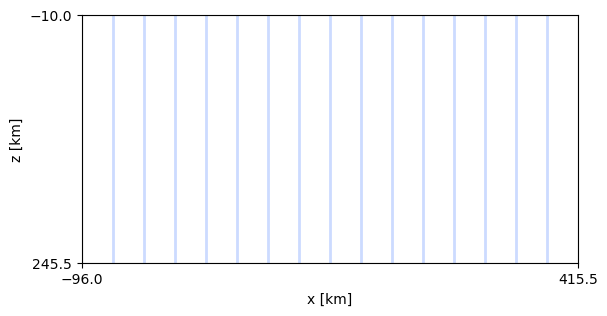
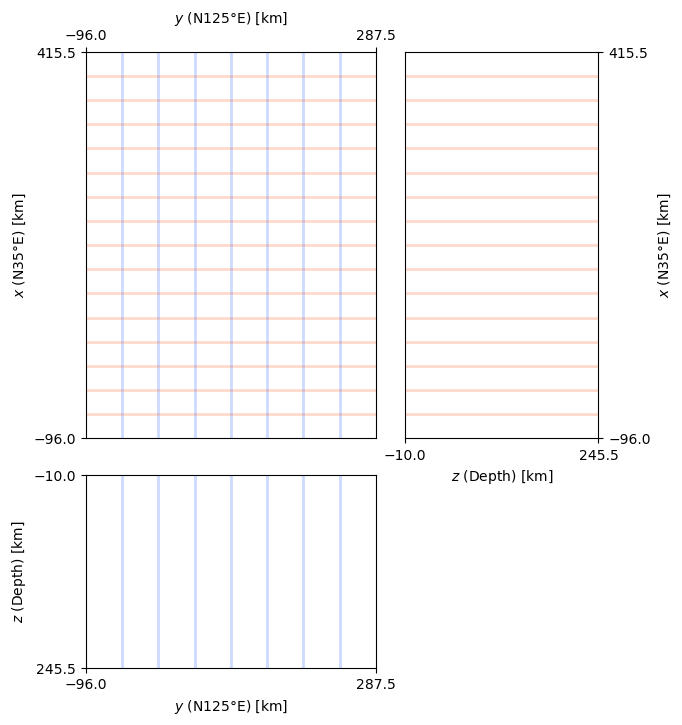
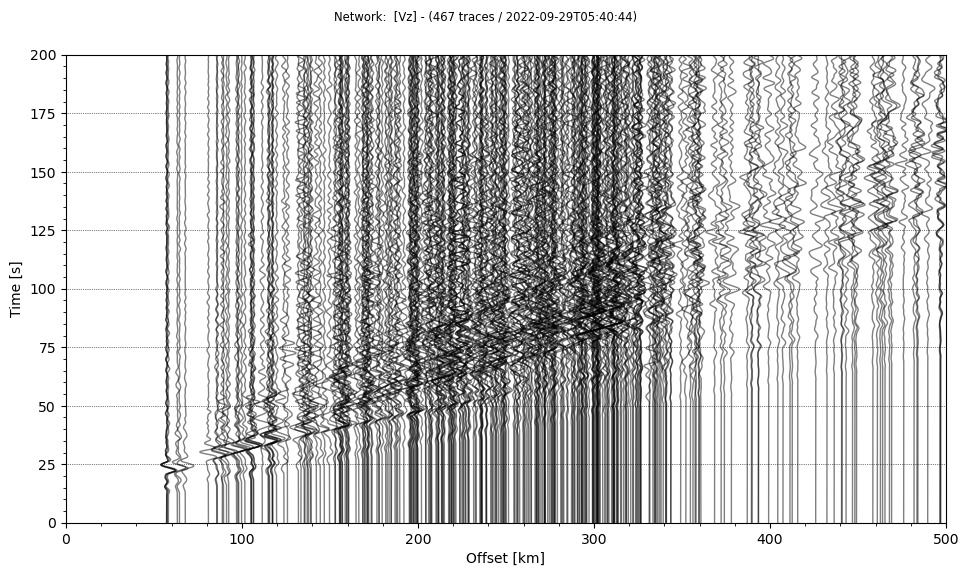
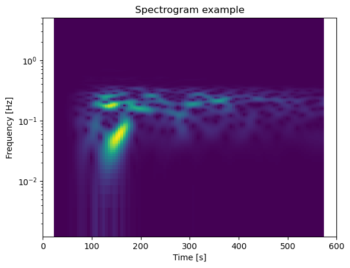
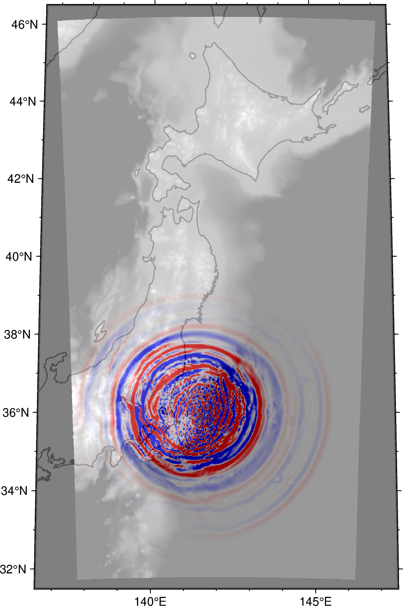

# Python integration

Python is a rapidly glowing ecosystem for data analysis and visualization in seismology. Followings are some tips & tricks for those who would like to handle the input/output of the OpenSWPC in python. The following example uses 

- ObsPy
- numpy
- xarray
- PyGMT

under the Jupyter Notebook environment. 

## Input parameter files

A python module `OpenSWPC/src/tools/swpc.py` contains several utility functions to handle input parameter to the OpenSWPC. To use it, first add this directory to the module path:


```python
import sys
sys.path.append('/path/to/OpenSWPC/src/tools/')
```

Then, the module can be loaded as follows: 


```python
import swpc
```

A function `prm_new()` create the default parameter set. These parameters are equivalent to that defined in `example/input.inf`.


```python
prm0 = swpc.prm_new()
```

Parameter data are stored in a simple dictionary as shown below. 


```python
print(prm0)
```

    {'title': 'swpc', 'odir': './out', 'ntdec_r': 50, 'strict_mode': False, 'nproc_x': 2, 'nproc_y': 2, 'nx': 384, 'ny': 384, 'nz': 384, 'nt': 1000, 'dx': 0.5, 'dy': 0.5, 'dz': 0.5, 'dt': 0.02, 'vcut': 1.5, 'xbeg': -96.0, 'ybeg': -96.0, 'zbeg': -10.0, 'tbeg': 0.0, 'clon': 139.7604, 'clat': 35.7182, 'phi': 0.0, 'fq_min': 0.02, 'fq_max': 2.0, 'fq_ref': 1.0, 'snp_format': 'netcdf', 'xy_ps%sw': False, 'xz_ps%sw': True, 'yz_ps%sw': False, 'fs_ps%sw': False, 'ob_ps%sw': True, 'xy_v%sw': False, 'xz_v%sw': True, 'yz_v%sw': False, 'fs_v%sw': False, 'ob_v%sw': True, 'xy_u%sw': False, 'xz_u%sw': True, 'yz_u%sw': False, 'fs_u%sw': False, 'ob_u%sw': True, 'z0_xy': 7.0, 'x0_yz': 0.0, 'y0_xz': 0.0, 'ntdec_s': 5, 'idec': 2, 'jdec': 2, 'kdec': 2, 'sw_wav_v': True, 'sw_wav_u': False, 'sw_wav_stress': False, 'sw_wav_strain': False, 'ntdec_w': 5, 'ntdec_w_prg': 0, 'st_format': 'xy', 'fn_stloc': './example/stloc.xy', 'wav_format': 'sac', 'stf_format': 'xym0ij', 'stftype': 'kupper', 'fn_stf': './example/source.dat', 'sdep_fit': 'asis', 'bf_mode': False, 'pw_mode': False, 'pw_ztop': 100.0, 'pw_zlen': 30.0, 'pw_ps': 'p', 'pw_strike': 0.0, 'pw_dip': 0.0, 'pw_rake': 0.0, 'abc_type': 'pml', 'na': 20, 'stabilize_pml': False, 'fullspace_mode': False, 'vmodel_type': 'lhm', 'is_ocean': True, 'topo_flatten': False, 'munk_profile': True, 'earth_flattening': False, 'vp0': 5.0, 'vs0': 3.0, 'rho0': 2.7, 'qp0': 200, 'qs0': 200, 'topo0': 0, 'dir_grd': 'dataset/vmodel/ejivsm/', 'fn_grdlst': './example/grd.lst', 'node_grd': 0, 'fn_lhm': 'example/lhm.dat', 'dir_rmed': './in/', 'fn_grdlst_rmed': './example/grd.lst', 'rhomin': 1.0, 'fn_rmed0': 'dummy.ns', 'green_mode': False, 'green_stnm': 'st01', 'green_cmp': 'z', 'green_trise': 1.0, 'green_bforce': False, 'green_maxdist': 550.0, 'green_fmt': 'llz', 'fn_glst': 'example/green.lst', 'stopwatch_mode': False, 'benchmark_mode': False, 'ipad': 0, 'jpad': 0, 'kpad': 0}


A function `prm_print(prm)` would be better for looking parameters: 


```python
swpc.prm_print(prm0)
```

    title              =   'swpc'
    odir               =   './out'
    ntdec_r            =   50
    strict_mode        =   .false.
    nproc_x            =   2
    nproc_y            =   2
    nx                 =   384
    ny                 =   384
    nz                 =   384
    nt                 =   1000
    dx                 =   0.5
    dy                 =   0.5
    dz                 =   0.5
    dt                 =   0.02
                 .
                 .
                 .
  
Also, one can read the parameter file by using `prm_read()` function rather than creating new one. For example, 

```python
prm1 = swpc.prm_read('/path/to/OpenSWPC/example/input.inf')
```
As this is a simple dictionary, the user can easily change the parameter values if necessary. 
```python
prm1['title'] = 'new-simulation'
prm1['nx'] = 1024
prm1['ny'] = 1024
prm1['nz'] = 1024
```

To save the parameter to use in OpenSWPC, use `prm_save()` function. 

```python
swpc.prm_save(prm, 'new.inf')
```

## Model viewer

functions `swpc.chkregion_2d()` and `swpc.chkregion_3d()` enables us to confirm the model size and coordinate settings visually. Here is an example: 


```python
prm2 = swpc.prm_new()

prm2['nx'] = 1024
prm2['ny'] = 768
prm2['nz'] = 512
prm2['nproc_x'] = 16
prm2['nproc_y'] = 8
prm2['phi'] = 35
```


```python
swpc.chkregion_2d(prm2);
```




```python
swpc.chkregion_3d(prm2);
```



The model region is partitioned into MPI sub-regions by color lines. 

## Output waveforms

[ObsPy](https://github.com/obspy/obspy/wiki/) is a de-facto standard on reading seismograms and applying basic manipulation of seismic data. Since the ObsPy can directly read the SAC-formatted seismogram, one can easily import the output waveform data generated by the OpenSWPC without any additional processings. 

Note that some user reported that the ObsPy occasionaly fails to specify the format when it reads SAC files produced by OpenSWPC properly. It is recommended to add `format='sac'` option to `obspy.read()` function to explicitly tell this is SAC-formatted file. 


```python
ls /path/to/OpenSWPC/output/wav/swpc_N.N.AAKH.Vz.sac
```

  /path/to/OpenSWPC/output/wav/swpc_N.N.AAKH.Vz.sac


```python
import obspy
```


```python
tr = obspy.read('/path/to/OpenSWPC/output/wav/*.Vz.sac', format='sac')
```


```python
# set distance to stats
# original distance header in stats.sac.dist is not read by record section plot function in obspy
for t in tr:
    t.stats.distance = t.stats.sac.dist * 1000
```


```python
tr.plot(type='section', scale=5, offset_min=0, offset_max=500*1000, recordlength=200, reduce = 7).show()
```


    

    


```python
tr[10].spectrogram(wlen=60, log=True, title='Spectrogram example')
```


    

    


## Output snapshots

2D snapshot data produced by OpenSWPC follows the [CF metadata conventions](https://cfconventions.org/) of [NetCDF](https://www.unidata.ucar.edu/software/netcdf/index.html) format. There seems several libraries to read NetCDF files, and here is an exaple using [xarray](https://docs.xarray.dev/en/stable/) which has an affinity to the [PyGMT](https://www.pygmt.org/latest/). 


```python
fn_ob = '/path/to/OpenSWPC/output/swpc_N.ob.v.nc'
```


```python
import xarray as xr
```


```python
xr_ob = xr.open_dataset(fn_ob)
```

xarray dataset contains multiple list (array) data, as the NetCDF data format. 
Each data can be obtained by appending data varialbe name after `.` of the object: 


```python
xr_ob.topo.data
```


    array([[-3902.103 , -3902.103 , -3902.103 , ...,   841.1037,   841.1037,
              841.1037],
           [-3902.103 , -3902.103 , -3902.103 , ...,   841.1037,   841.1037,
              841.1037],
           [-3902.103 , -3902.103 , -3902.103 , ...,   841.1037,   841.1037,
              841.1037],
           ...,
           [-6059.085 , -6059.085 , -6059.085 , ..., -3449.3516, -3449.3516,
            -3449.3516],
           [-6059.085 , -6059.085 , -6059.085 , ..., -3449.3516, -3449.3516,
            -3449.3516],
           [-6059.085 , -6059.085 , -6059.085 , ..., -3449.3516, -3449.3516,
            -3449.3516]], dtype=float32)


```python
xr_ob.lon.data
```


    array([[137.7886 , 137.788  , 137.78738, ..., 136.83992, 136.83867,
            136.8374 ],
           [137.80438, 137.80377, 137.80316, ..., 136.85922, 136.85797,
            136.85672],
           [137.82018, 137.81956, 137.81895, ..., 136.87854, 136.87729,
            136.87604],
           ...,
           [146.17456, 146.17517, 146.17578, ..., 147.11504, 147.11627,
            147.11752],
           [146.19035, 146.19096, 146.19157, ..., 147.13434, 147.13559,
            147.13684],
           [146.20613, 146.20674, 146.20737, ..., 147.15364, 147.1549 ,
            147.15616]], dtype=float32)


```python
xr_ob.lat.data
```


    array([[31.725807, 31.7393  , 31.752792, ..., 46.056538, 46.06998 ,
            46.08342 ],
           [31.72633 , 31.739822, 31.753315, ..., 46.05741 , 46.070854,
            46.084293],
           [31.726849, 31.740343, 31.753836, ..., 46.05828 , 46.07172 ,
            46.085163],
           ...,
           [31.727022, 31.740515, 31.754007, ..., 46.058567, 46.07201 ,
            46.085453],
           [31.726503, 31.739996, 31.753489, ..., 46.0577  , 46.071144,
            46.084583],
           [31.725983, 31.739475, 31.752968, ..., 46.056828, 46.07027 ,
            46.083714]], dtype=float32)


... and time slice of the wavefield can be reffered by the sequential time step number like


```python
xr_ob.Vz[50].data
```


    array([[0., 0., 0., ..., 0., 0., 0.],
           [0., 0., 0., ..., 0., 0., 0.],
           [0., 0., 0., ..., 0., 0., 0.],
           ...,
           [0., 0., 0., ..., 0., 0., 0.],
           [0., 0., 0., ..., 0., 0., 0.],
           [0., 0., 0., ..., 0., 0., 0.]], dtype=float32)


Note that the OpenSWPC performs simulations in the Cartesian coordinate. The result is mapped to the geographical cooridnate upon output, but the data is not evenly-spaced in longitude-latitude system. Thus, interpolation and/or resampling may be necessary to plot the wavefield on a map. 


```python
import pygmt
import numpy as np
```


```python
# make interpolated grid data by nearneighbor function

region = [136.5, 147.5, 31.5, 46.5]
spacing = 0.01
radius = 0.05

# topography grid
grd_topo = pygmt.nearneighbor(x = xr_ob.lon.data.ravel(), 
                              y = xr_ob.lat.data.ravel(),
                              z = xr_ob.topo.data.ravel(), 
                              region = region, spacing = spacing, search_radius = radius) 

# wavefield at 50th time step
grd_wave = pygmt.nearneighbor(x = xr_ob.lon.data.ravel(), 
                              y = xr_ob.lat.data.ravel(),
                              z = xr_ob.Vz[50].data.ravel(), 
                              region = region, spacing = spacing, search_radius = radius) 
```


```python
fig = pygmt.Figure()

with pygmt.config(MAP_FRAME_TYPE  = 'plain'):
    
    # background topography
    pygmt.makecpt(cmap='gray', series=[-2000, 2000, 500], continuous=True)
    fig.grdimage(grid=grd_topo, projection='N142/10c', region=region, frame=['WSen', 'xaf', 'yaf'])
    
    # coastline
    fig.coast(resolution = 'h', area_thresh = 100, shorelines='thin,black')
    
    # wavefield with tranparency
    pygmt.makecpt(cmap='polar',series = [-0.1, 0.1, 0.02], continuous=True, background=True)
    fig.grdimage(grid=grd_wave, transparency=40)

fig.show()
```


    
{ width="50%" }
    

