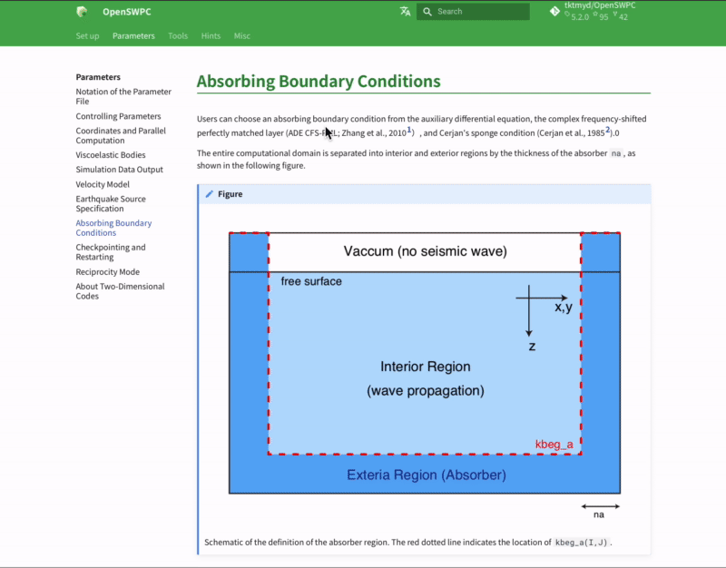

# Version History & New features

## Version 25.05 (2025-05-20)

### GPGPU-Ready

This is the first version to support GPGPU computing via OpenACC.

- All simulation codes (swpc_3d, swpc_psv swpc_sh) now support many-GPU computing using OpenACC and MPI, enabling ultra-high-speed operation.
- Supporting tools can also be compiled with NVIDIA's nvfortran and run properly not only on x86 architectures but also on NVIDIA Grace CPUs.

## Version 25.01 (2025-01-04)

### Velocity Structure Model Linear Gradient Model (`lgm`)

It is now possible to create a model in which seismic wave velocity varies linearly within a layer, using the same format input file as the Lateral Homogeneous Medium (`lhm`).
This allows the user to apply a velocity structure that smoothly changes with depth to simulations.

The figures below show PS snapshots of the P-SV code for `vmodel=“lhm”` and `vmodel=“lgm”` using the same structural model file provided in the OpenSWPC `example`. Compared to `lhm`, `lgm` has a relatively simple wave field, with fewer reflected and converted waves at the internal boundary due to the absence of the velocity discontinuity surface (the gray horizontal line).


/// caption
Example of a numerical simulation snapshot of `swpc_psv` using the structural model file `example/lhm.dat`. The left image was calculated using `vmodel=“lhm”` and the right image was calculated using `vmodel=“lgm”`.
///

On the other hand, the `lgm` model can also express velocity discontinuity surfaces. In other words, `lgm` is a superset that includes `lhm`. In addition, `lgm_rmed`, which corresponds to `lhm_rmed` with a random medium superimposed, is also provided.

### `tar` archive format for waveform output

A function has been added to output seismic waveform files in SAC format as a single `tar` archive for each observation point or for all waveforms from the output node (`wav_format = “tar_st”`, `wav_format = “tar_node”`).

Since `tar` is an archive for a single file and does not include compression, the size of the output file will not change much. However, by reducing the number of output files through archiving, it is expected that data output will be more efficient and that file management after output will be easier.

If one use the seismology library [ObsPy](https://docs.obspy.org) in Python, one can read the SAC waveform files that have been archived as `tar` without extracting them.

Until now, the proprietary binary `csf` format has been provided as a format for combining multiple waveform data into a single file. As the purpose of this format is duplicated, `csf` output is depreciated and will be removed in future versions.

### Epicentral distance in waverform files

The default behavior is now to record the epicentral distance in the header of the waveform file, which was previously an optional function controlled by the `calc_wav_dist` parameter. The `calc_wav_dist` parameter has been removed.

### Change in output file name

The problem of overwriting output file names due to duplication when executing the `SH`, `P-SV` and `3D` codes from the same input parameter file has been resolved. For this reason, the code name is now added to the output file name.

In addition, images and data output from `read_snp.x` are now divided into directories by type.

### Documentation update

The entire documentation was reviewed; outdated information was updated, as well as the explanations were reinforced.

### Minor bugfixes

- Fixed a problem where the waveform time could not be read correctly in some environments due to the SAC header `nzmsec` being undefined
- Fixed a problem where the initial value `-12345` of the SAC header `kf` was not output correctly
- Corrected the UT-LocalTime discrepancy in the time stamps recorded in the waveform and snapshot output
- Fixed the file name in the JIVSM structure model creation script
- Addressed the issue of the output directory sometimes failing to be created on a shared file system

## Version 24.09 (2024-09-13)

Starting with this release, OpenSWPC uses the [Calender Versioning](https://calver.org/) scheme. The version number is determined by `YY.0M` (year and month with zero padding).

### High-speed snapshot data export

By using a new algorithm, snapshot data export is significantly accelerated, resulting in a maximum reduction of ~20% of the total computation time for 3D simulation.

### Waveform output during calculation

Previously, seismic waveform files were not created at a station until all calculations were completed. By setting the new parameter `ntdec_wav_prg`, waveforms are periodically output during the computation. The waveform amplitudes for the parts of the waveform that have not yet been computed are filled with zeros. This new feature allows users to monitor the computation in the middle of a calculation. However, be careful not to use too frequent output, as it may affect the speed of the computation.

### Remove Checkpointing/Restarting functionality

In order to continue to improve the code, we have decided to remove the Checkpointing/Restarting feature, which we believe is now rarely used. If you wish to use this feature, we recommend that you continue to use Version 5.3.1. There is no difference in calculation results between this version and Version 5.3.1.

### NetCDF is always needed

Until now, it was not impossible to compile without the NetCDF library. However, since it is impractical to use this tool without NetCDF, we have simplified the code by always requiring a link to the NetCDF library at compile time.

### Code modernization

We have eliminated the old Fortran90/95 era syntax and #ifdef-#endif macro branches that were maintained for compatibility with some past supercomputers, and rewritten much of the code in the simpler and more modern notation of Fortran2003 and later. Some newer Fortran 2008 syntax is included, but we are pretty confident that it is within the scope of most compilers currently available.

## Version 5.3.1 (2024-04-14)

### Version information option

All executables (binaries with a `.x` filename extension in the `bin/` directory) now accept `-v` or `--version` options to display the current version number, as shown below.

```
% ./bin/swpc_psv.x -v
swpc_psv (OpenSWPC) version 5.3.1
```

### Repository change

Starting with version 5.3.1, code will be released from the new organizational repository (<https://github.com/OpenSWPC/OpenSWPC>). Links to the old repository will be redirected to the new one, and the old version of the information will not be lost.
Also, starting with this release, the online documentation will be maintained separately from the OpenSWPC source code. The documentation repository is <https://github.com/OpenSWPC/OpenSWPC.github.io>.

A new organization repository (<https://github.com/OpenSWPC/OpenSWPC>)

## Version 5.3.0 (2023-02-02)

### Better parallel partitioning

In previous versions, automatic MPI area allocation sometimes failed when the number of grids in the X or Y direction was not divisible by the number of MPI partitions and the number of MPI partitions was very large.

This problem has been fixed in version 5.3.0.

In new version, the partitioning algorithm is as follows:

Let $N$ be the number of grid, and $P$ the number of MPI partitions. If $N$ is divisible by $P$, i.e., $\mod(N,P)= 0$, the number of grids assigned to a node is $N_P = N/P$. If this is not the case, the following rule is applied:

| Node ID | Number of Grids $N_P$ |
| ------- | -------------------- |
| 0 to $P$-$M$-1 | $N_P = (N-M)/P$ |
| $P$-$M$ to $P$-1 | $N_P = (N-M)/P + 1$ |

(where $M = \mod(N,P)$)

### Python integration

An example of processing OpenSWPC input/output in Python is included in [this manual](./3._Tools/0305_python.en.md).

### Updated documentation

#### Try OpenSWPC on cloud

See [this example](./1._SetUp/0100_trial.en.md). This is also would be a nice guide to compile the OpenSWPC in Ubuntu Linux.

#### Better switching between EN/JP documentation

- One can switch between Japanese and English documentation using the button to the left of the search box.

- Untranslated documents (for example, this page) are displayed in English even in Japanese mode.



### Others

- Tune-up in some supercomputers
- Updated version of Japanese community model [JIVSM](./1._SetUp/0104_dataset.md).

## Previous Revision Histories

2021-08-27 (v5.2.0)

:   Earth-flattening transformation, psmeca (a new source representation), seawater velocity structure w/ SOFAR channel, a new tool that converts 2D simulation output into pseudo-3D, supporting new Japanese supercomputers, and some minor bugfixes.

2020-08-13 (v5.1.0)

:   Strict-mode

2019-08-27 (v5.0.0)

:   New web-based documentation, stress/strain waveform output, slip-based source specification, and many bugfixes.

2017-09-21 (v4.0)

:   Minor bugfixes, new binary output for waveform, updated references.

2016-08-20 (v3.0)

:   Hybrid parallel simulation for 2D codes.

2016-06-19 (v2.0)

:   Hybrid parallel simulation for 2D codes.

2016-05-05 (v1.0)

:   Official first release as an open-source software

2016-02-03

:   Output in \texttt{NetCDF} format.

2016-01-14

:   Body force and reciprocity modes.

2015-07-14

:   MPI/OpenMP hybrid parallel simulation mode.

2015-06-29

:   Added random media.

2015-06-10

:   Revision for the new Earth Simulator.

2015-06-04

:   First closed version for the ERI/UT joint usage program.
