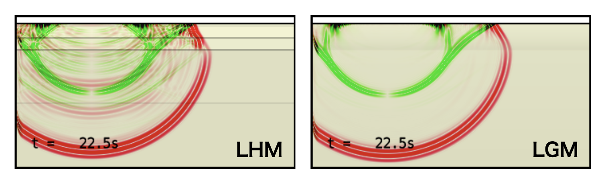
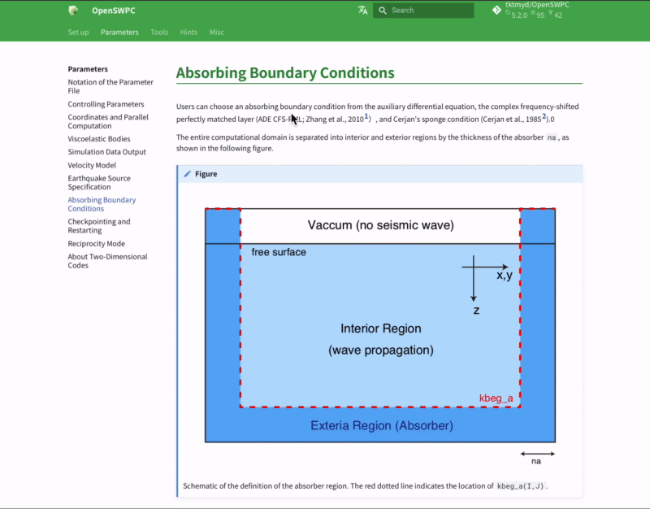

# 更新履歴・新機能紹介

## Version 25.01 (2025-01-04)

### 速度構造モデル Linear Gradient Model (`lgm`)

Laterally Homogeneous Medium (`lhm`) と同じ形式入力ファイルから，地震波速度が層内で線形に変化するモデルを作成できるようになった．
これにより，深さとともになめらかに変化する速度構造をシミュレーションに適用することができる．

下図は，OpenSWPCの`example`に提供されている同じ構造モデルファイルを用いて `vmodel="lhm"` と `vmodel="lgm"` でそれぞれP-SVコードのPSスナップショットである．`lhm` と比べて，`lgm` は速度不連続面（灰色横線）がなくなった分，内部境界の反射波や変換波が小さくなり，波動場が相対的に単純になっている．


/// caption
構造モデルファイル `example/lhm.dat` を用いた `swpc_psv` の数値シミュレーションスナップショットの例．<br>左は `vmodel="lhm"`，右は `vmodel="lgm"` で計算したもの．
///

一方，`lgm` モデルでも速度不連続面を表現することができる．すなわち，`lgm` は`lhm` を含んだスーパーセットである．また，ランダム媒質を重畳した `lhm_rmed` に対応する `lgm_rmed` も提供される．


### 波形出力の`tar` アーカイブ形式

SAC形式による地震波形ファイル出力を，観測点ごと，あるいは出力ノードからの全波形でそれぞれ1つの `tar` アーカイブとして出力する機能（`wav_format = "tar_st"`, `wav_format = "tar_node"`）が追加された．

`tar` はあくまでも単一ファイルへのアーカイブであり，圧縮機能は付していませんので，出力されるファイルサイズはほとんど変わらない．だが，アーカイブによって出力ファイル数が減ることで，データ出力が効率化されるとともに，出力後のファイル管理が容易になると期待される．ちなみに，Pythonにおける地震学ライブラリ[ObsPy](https://docs.obspy.org)を用いれば，`tar`アーカイブされたSAC波形ファイルは展開せずにそのまま読み込むことができる．

これまでは複数の波形データを単一ファイルにまとめる形式として，独自バイナリの`csf`形式が提供されていた．目的が重複するため，`csf` 出力はdepreciatedとし，今後のバージョンで削除される予定である．

### 波形ファイルの距離計算

従来は `calc_wav_dist` パラメタによるオプション機能であった波形ファイルのヘッダへの震央距離の記録がデフォルト挙動となり，パラメタ `calc_wav_dist` は廃止された．


### 出力データ名の変更

同じ入力パラメタファイルから `SH`, `P-SV`, `3D` の各コードを実行した際に，出力ファイル名が重複していることにより上書きされる問題を解消した．このため，出力ファイル名にコード名が追加されるようになった．
また，`read_snp.x` から出力される画像やデータは，種別ごとにディレクトリ分けされるようになった．

### ドキュメントの追加整備

マニュアル全体を見直し，古くなった情報を更新するとともに，解説を補強した．

### Minor bugfixes

- SAC header `nzmsec` が未定義であったため，一部環境で波形時刻が正しく読めない問題を修正
- SAC headr `kf` の初期値 `-12345` が正しく出力されない問題の修正
- 波形・スナップショット出力に記録されるタイムスタンプのUT-LocalTimeズレを補正
- JIVSM構造モデル作成スクリプト内のファイル名を修正
- 共有ファイルシステムにおいて出力ディレクトリの作成に失敗することがある問題への対処

## Version 24.09 (2024-09-13)

このリリースからOpenSWPC は [Calender Versioning](https://calver.org/) スキームを使用します． バージョン番号は `YY.0M` (年と月をゼロパディングで表したもの) で決定されます．

### スナップショットデータ出力の大幅な高速化

新しいアルゴリズムの採用によりスナップショットデータのエクスポートが大幅に高速化されました．3Dシミュレーションの場合，総計算時間が最大で20％削減されました．

### 計算途中の波形出力

これまでは，地震波形ファイルはすべての計算が完了するまで作成されませんでした．
新パラメータ `ntdec_wav_prg` を設定することで，計算中に定期的に波形が出力できるようになりました．このとき，計算が完了していない部分の波形の振幅はゼロで埋められます，
この新機能により，計算の途中でも計算のモニタリングが可能になりました．ただし，出力の頻度が高すぎると計算速度に影響が出る可能性があるので注意が必要です．

### チェックポイント・リスタート機能の削除

今後もコードの改善を継続していくため，現在ではほとんど使用されていないと思われるチェックポイント/再起動機能を削除することにしました．
もし引き続きこの機能を使用したい場合は，バージョン5.3.1をご使用ください．このバージョンとバージョン5.3.1との間で，計算結果に違いはありません．

### NetCDF の常時リンク

これまで，NetCDFライブラリなしでコンパイルすることもできました．
しかし，OpenSWPCは入出力の便利な機能をNetCDFファイルの利用に依存しており，それなしでこのツールを使用することは現実的ではないため，コンパイル時に常にNetCDFライブラリへのリンクを要求することでコードを簡素化しました．

### Code Modernization

過去のスーパーコンピューターとの互換性を保つために維持されていた，古いFortran90/95時代の構文や`#ifdef`-`#endif`マクロを排除し，コードの大部分をよりシンプルで現代的表記法であるFortran2003以降で書き直しました．一部にはさらに新しいFortran 2008以降の構文も含まれていますが，現在利用可能なほとんどのコンパイラーの範囲内であると確信しています．

## Version 5.3.1 (2024-04-14)

### Version information option

All executables (binaries with a `.x` filename extension in the `bin/` directory) now accept `-v` or `--version` options to display the current version number, as shown below. 

```
% ./bin/swpc_psv.x -v
swpc_psv (OpenSWPC) version 5.3.1
```

### Repository change

Starting with version 5.3.1, code will be released from the new organizational repository (https://github.com/OpenSWPC/OpenSWPC). Links to the old repository will be redirected to the new one, and the old version of the information will not be lost.
Also, starting with this release, the online documentation will be maintained separately from the OpenSWPC source code. The documentation repository is https://github.com/OpenSWPC/OpenSWPC.github.io.

A new organization repository (https://github.com/OpenSWPC/OpenSWPC) 

## Version 5.3.0 (2023-02-02)

### Better parallel partitioning

In previous versions, automatic MPI area allocation sometimes failed when the number of grids in the X or Y direction was not divisible by the number of MPI partitions and the number of MPI partitions was very large. 

This problem has been fixed in version 5.3.0. 

In new version, the partitioning algorithm is as follows: 

Let $N$ be the number of grid, and $P$ the number of MPI partitions. If $N$ is divisible by $P$, i.e., $\mod(N,P)= 0$, the number of grids assigned to a node is $N_P = N/P$. If this is not the case, the following rule is applied: 

| Node ID | Number of Grids $N_P$ |
| ------- | -------------------- |
| 0 to $P$-$M$-1 | $N_P = (N-M)/P$ |
| $P$-$M$ to $P$-1 | $N_P = (N-M)/P + 1$ |

(where $M = \mod(N,P)$)


### Python integration

An example of processing OpenSWPC input/output in Python is included in [this manual](./3._Tools/0305_python.en.md).

### Updated documentation
#### Try OpenSWPC on cloud!

See [this example](./1._SetUp/0100_trial.en.md). This is also would be a nice guide to compile the OpenSWPC in Ubuntu Linux. 

#### Better switching between EN/JP documentation

- One can switch between Japanese and English documentation using the button to the left of the search box.

- Untranslated documents (for example, this page) are displayed in English even in Japanese mode. 




### Others

- Tune-up in some supercomputers
- Updated version of Japanese community model [JIVSM](./1._SetUp/0104_dataset.md).


## Previous Revision Histories

2021-08-27 (v5.2.0)

:   Earth-flattening transformation, psmeca (a new source representation), seawater velocity structure w/ SOFAR channel, a new tool that converts 2D simulation output into pseudo-3D, supporting new Japanese supercomputers, and some minor bugfixes. 

2020-08-13 (v5.1.0)

:   Strict-mode

2019-08-27 (v5.0.0)

:   New web-based documentation, stress/strain waveform output, slip-based source specification, and many bugfixes. 

2017-09-21 (v4.0)

:   Minor bugfixes, new binary output for waveform, updated references.

2016-08-20 (v3.0)

:   Hybrid parallel simulation for 2D codes.

2016-06-19 (v2.0)

:   Hybrid parallel simulation for 2D codes.

2016-05-05 (v1.0)

:   Official first release as an open-source software

2016-02-03

:   Output in \texttt{NetCDF} format.

2016-01-14

:   Body force and reciprocity modes.

2015-07-14

:   MPI/OpenMP hybrid parallel simulation mode.

2015-06-29

:   Added random media.

2015-06-10

:   Revision for the new Earth Simulator.

2015-06-04

:   First closed version for the ERI/UT joint usage program.

