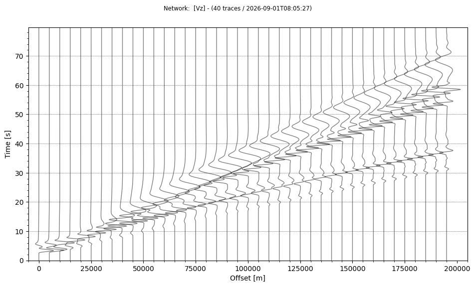

# Getting Started

OpenSWPCは簡単なパラメタ設定により複雑な地球内部構造下における地震波動伝播をシミュレーションできるコードです．

そのコンパイルや実行がどのように行われるかを，Google Colaboratoryの[Notebook](https://colab.research.google.com/gist/tktmyd/e5c7af6cda0945248029166704a75a24/OpenSWPC_trial.ja.ipynb)でお試しいただけます．このNotebookでは，OpenSWPCをクラウド上でダウンロード・コンパイルし，鉛直断面の2次元P-SV問題の地震波動伝播数値シミュレーションを並列実行し，以下のような波動伝播のスナップショットムービーや，地表面における地震波速度波形のレコードセクションの作成を体験できます．閲覧だけならどなたでもできますが，自分で実行するためにはGoogleアカウントが必要です．

{ width="680" }
/// caption
///

{ width="680" }
/// caption
///

